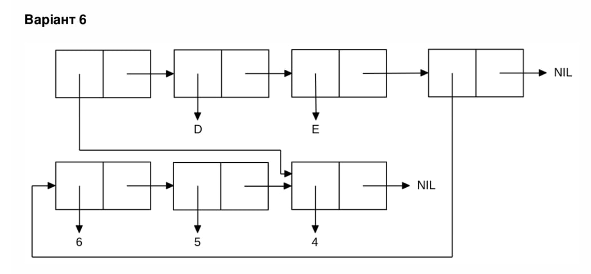

<p align="center"><b>МОНУ НТУУ КПІ ім. Ігоря Сікорського ФПМ СПіСКС</b></p>
<p align="center">
<b>Звіт з лабораторної роботи 1</b><br/>
"Обробка списків з використанням базових функцій"<br/>
дисципліни "Вступ до функціонального програмування"
</p>
<p align="right"><b>Студентка</b>: Ус Вікторія Олександрівна, КВ-12</p>
<p align="right"><b>Рік</b>: 2024</p>

### Загальне завдання  
1. Створіть список з п'яти елементів, використовуючи функції `LIST` і `CONS`. Форма створення списку має бути одна — використання `SET` чи `SETQ` (або інших допоміжних форм) для збереження проміжних значень не допускається. Загальна кількість елементів (включно з підсписками та їх елементами) не має перевищувати 10-12 шт. (дуже великий список робити не потрібно). Збережіть створений список у якусь змінну з `SET` або `SETQ`. Список має містити (напряму або у підсписках):  
   - хоча б один символ  
   - хоча б одне число  
   - хоча б один не пустий підсписок  
   - хоча б один пустий підсписок  
2. Отримайте голову списку.  
3. Отримайте хвіст списку.  
4. Отримайте третій елемент списку.  
5. Отримайте останній елемент списку.  
6. Використайте предикати `ATOM` та `LISTP` на різних елементах списку (по 2-3 приклади для кожної функції).  
7. Використайте на елементах списку 2-3 інших предикати з розглянутих у розділі 4 навчального посібника.  
8. Об'єднайте створений список з одним із його непустих підсписків. Для цього використайте функцію `APPEND`.


```lisp
;; Пункт 1
;; mylist: (10 (X1 X2) V (20 30) NIL VAR (PROG 40 RES))

(defvar mylist nil)
(setq mylist (cons 10 (cons (list 'X1 'X2) (cons 'V (cons (list 20 30) (cons '() (cons 'var (cons (list 'prog 40 'res) nil))))))))

(format t "~%1. Printing mylist")
(print mylist)

(format t "~%2. Head of mylist * 10 *")
(print (car mylist))

(format t "~%3. Mylist tail * ((X1 X2) V (20 30) NIL VAR (PROG 40 RES)) *")
(print (cdr mylist))

(format t "~%4. Element #3 of mylist * V *")
(print (third mylist))

(format t "~%5. Last element of mylist * (PROG 40 RES) *")
(print (car (last mylist)))

(format t "~%6.1.1 Usage of the predicate ATOM for element #1 * 10 *")
(print (atom (car mylist)))

(format t "~%6.1.2 Usage of the predicate ATOM for element #2 * (X1 X2) *")
(print (atom (second mylist)))

(format t "~%6.1.3 Usage of the predicate ATOM for element #3 * V *")
(print (atom (nth 2 mylist)))

(format t "~%6.2.1 Usage of the predicate LISTP for element #4 * (20 30) *")
(print (listp (nth 3 mylist)))

(format t "~%6.2.2 Usage of the predicate LISTP for element #5 * NIL *")
(print (listp (nth 4 mylist)))

(format t "~%6.2.3 Usage of the predicate LISTP for the last element * (PROG 40 RES) *")
(print (listp (last mylist)))

(format t "~%7.1.1 Usage of the predicate NULL for element #5 * NIL *")
(print (null (nth 4 mylist)))

(format t "~%7.1.2 Usage of the predicate NULL for element #2 * (X1 X2) *")
(print (null (second mylist)))

(format t "~%7.2.1 Usage of the predicate EQUALP between 10.000 and element #1 * 10 *")
(print (equalp (car mylist) 10.000))

(format t "~%7.2.2 Usage of the predicate EQUALP between 'v' and element #3 * V *")
(print (equalp (third mylist) 'v))

(format t "~%8. Usage of the function APPEND with the last element * (PROG 40 RES) *")
(print (append mylist (last mylist)))
```
### Результат роботи програми для пункту №1

```lisp
1. Printing mylist
(10 (X1 X2) V (20 30) NIL VAR (PROG 40 RES)) 
2. Head of mylist * 10 *
10 
3. Mylist tail * ((X1 X2) V (20 30) NIL VAR (PROG 40 RES)) *
((X1 X2) V (20 30) NIL VAR (PROG 40 RES)) 
4. Element #3 of mylist * V *
V 
5. Last element of mylist * (PROG 40 RES) *
(PROG 40 RES) 
6.1.1 Usage of the predicate ATOM for element #1 * 10 *
T 
6.1.2 Usage of the predicate ATOM for element #2 * (X1 X2) *
NIL 
6.1.3 Usage of the predicate ATOM for element #3 * V *
T 
6.2.1 Usage of the predicate LISTP for element #4 * (20 30) *
T 
6.2.2 Usage of the predicate LISTP for element #5 * NIL *
T 
6.2.3 Usage of the predicate LISTP for the last element * (PROG 40 RES) *
T 
7.1.1 Usage of the predicate NULL for element #5 * NIL *
T 
7.1.2 Usage of the predicate NULL for element #2 * (X1 X2) *
NIL 
7.2.1 Usage of the predicate EQUALP between 10.000 and element #1 * 10 *
T 
7.2.2 Usage of the predicate EQUALP between 'v' and element #3 * V *
T 
8. Usage of the function APPEND with the last element * (PROG 40 RES) *
(10 (X1 X2) V (20 30) NIL VAR (PROG 40 RES) (PROG 40 RES))
```

### Варіант 6 (22)
Створіть список, що відповідає структурі списку, наведеній на рисунку (за варіантом). Для цього допускається використання не більше двох форм конструювання списку на "верхньому рівні". Але аргументами цих форм можуть бути результати інших викликів форм конструювання списків. Номер варіанту обирається як номер у списку групи, який надсилає викладач на початку семестру (на випадок, якщо протягом семестру стануться зміни в складі групи), за модулем 8: 1 -> 1, 2 -> 2, ..., 9 -> 1, 10 -> 2, ...
<p align="center">
    
</p>

```lisp
;; Пункт 2

(defvar mylist_2 nil)
(setq mylist_2 (cons 4 (cons (list 'D 'E) (cons (list 6 5 4) nil))))
(format t "~%Printing mylist_2")
(print mylist_2)
```

### Результат роботи програми для пункту №2

```
Printing mylist_2
(4 (D E) (6 5 4))
```

