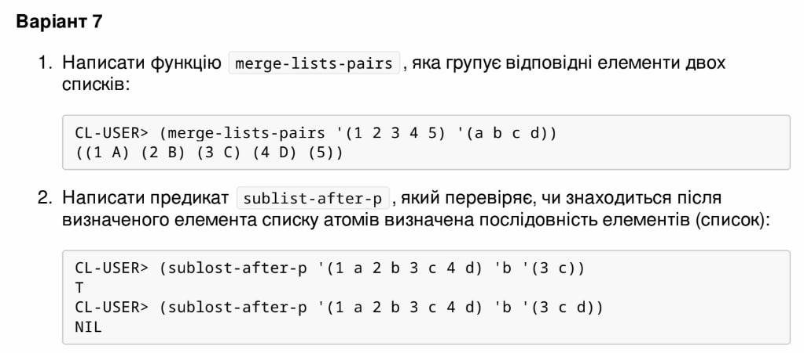

<p align="center"><b>МОНУ НТУУ КПІ ім. Ігоря Сікорського ФПМ СПіСКС</b></p>
<p align="center">
<b>Звіт з лабораторної роботи 2</b><br/>
"Рекурсія"<br/>
дисципліни "Вступ до функціонального програмування"
</p>
<p align="right"><b>Студентка</b>: Ус Вікторія Олександрівна, КВ-12</p>
<p align="right"><b>Рік</b>: 2024</p>

### Загальне завдання  
Реалізуйте дві рекурсивні функції, що виконують деякі дії з вхідним(и) списком(-ами), за
можливості / необхідності використовуючи різні види рекурсії. Функції, які необхідно
реалізувати, задаються варіантом. Вимоги до функцій:
  1. Зміна списку згідно із завданням має відбуватись за рахунок конструювання нового
списку, а не зміни наявного (вхідного).
  2. Не допускається використання функцій вищого порядку чи стандартних функцій
для роботи зі списками, що не наведені в четвертому розділі навчального
посібника.
  3. Реалізована функція не має бути функцією вищого порядку, тобто приймати функції
в якості аргументів.
  4. Не допускається використання псевдофункцій (деструктивного підходу).
  5. Не допускається використання циклів.
Кожна реалізована функція має бути протестована для різних тестових наборів. Тести
мають бути оформленні у вигляді модульних тестів.

### Варіант 7 (22)

<p align="center">
    
</p>

### Лістинг першої функції merge-lists-pairs

```lisp
(defun merge-lists-pairs (list_1 list_2)
(cond
((and (null list_1) (null list_2)) nil)
((null list_1) 
(cons (list (car list_2))
(merge-lists-pairs list_1 (cdr list_2))))
((null list_2) 
(cons (list (car list_1))
(merge-lists-pairs (cdr list_1) list_2)))
(t (cons (list (car list_1) (car list_2))
(merge-lists-pairs (cdr list_1) (cdr list_2))))))
```

### Тестові набори для першої функції

```lisp
(defun start_check_1 ()
(check_1 "test 1" '(1 2 3 4 5) '(A B C D) '((1 A) (2 B) (3 C) (4 D) (5)))
(check_1 "test 2" '(1) '(K P I) '((1 K) (P) (I)))
(check_1 "test 3" '() '() NIL))
```

### Тестування

```lisp
(start_check_1)
passed test 1
passed test 2
passed test 3
NIL
```

### Лістинг другої функції sublist-after-p

```lisp
(defun is-in-list (element list)
  (cond
    ((null list) nil) 
    ((eql (car list) element) (cdr list)) 
    (t (is-in-list element (cdr list))))) 

(defun sublist-after-p (list_1 element list_2)
  (let ((remaining (is-in-list element list_1))) 
    (cond
      ((null list_2) t)      
      ((null remaining) nil) 
      (t (if (equal (car remaining) (car list_2))
      (sublist-after-p remaining (car list_2) (cdr list_2)) 
      nil)))))
```

### Тестові набори для другої функції

```lisp
(defun start_check_2 ()
(check_2 "test 1" '(1 2 A B 3 4) '2 '(A B 3) T)
(check_2 "test 2" '(2 3 C 4 F 5) 'C '(4 5 F) NIL)
(check_2 "test 3" '() 'K '(1 2 3) NIL))
```

### Тестування

```lisp
(start_check_2)
passed test 1
passed test 2
passed test 3
NIL
```

