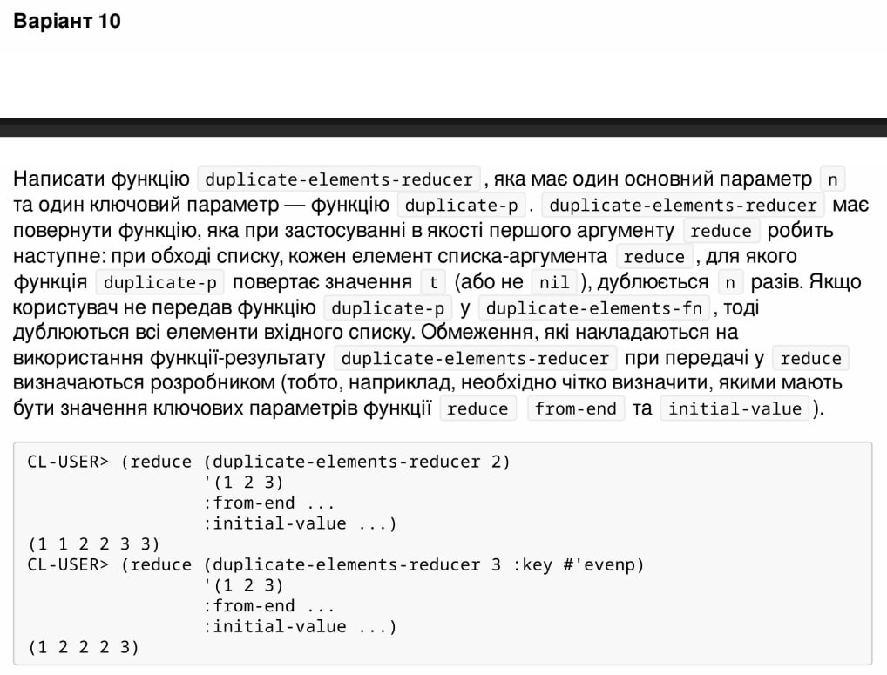

<p align="center"><b>МОНУ НТУУ КПІ ім. Ігоря Сікорського ФПМ СПіСКС</b></p>
<p align="center">
<b>Звіт з лабораторної роботи 4</b><br/>
"Функції вищого порядку та замикання"<br/>
дисципліни "Вступ до функціонального програмування"
</p>
<p align="right"><b>Студентка</b>: Ус Вікторія Олександрівна, КВ-12</p>
<p align="right"><b>Рік</b>: 2024</p>

### Загальне завдання 
Завдання складається з двох частин:
1. Переписати функціональну реалізацію алгоритму сортування з лабораторної
роботи 3 з такими змінами:
використати функції вищого порядку для роботи з послідовностями (де це
доречно);
додати до інтерфейсу функції (та використання в реалізації) два ключових
параметра: key та test , що працюють аналогічно до того, як працюють
параметри з такими назвами в функціях, що працюють з послідовностями. При
цьому key має виконатись мінімальну кількість разів.
2. Реалізувати функцію, що створює замикання, яке працює згідно із завданням за
варіантом. Використання псевдо-функцій не забороняється, але, за
можливості, має бути мінімізоване.

### Варіант першої частини 6 (22)
<p align="center">
    
</p>

### Лістинг реалізації першої частини завдання
```lisp
(defun insertion-sort-1 (lst &key (key #'identity) (test #'<=))
  (labels ((insert (x sorted)
    (if (null sorted) 
        (list x) 	; Якщо список порожній, просто додаємо елемент
      (let* ((head (car sorted))
	     (head-key (funcall key head))
	     (x-key (funcall key x)))
        (if (funcall test x-key head-key) 
            (cons x sorted) ; Якщо X менше або рівне першому елементу, вставляємо на початок
            (cons head (insert x (cdr sorted)))))))) ; Інакше вставляємо елемент в решту списку
    (if (null lst)
        nil 	; Якщо список порожній, повертаємо порожній список
      (insert (car lst) (insertion-sort-1 (cdr lst) :key key :test test))))) ; Вставляємо перший елемент у відсортовану частину решти списку
```

### Тестові набори та утиліти першої частини
```lisp
(defun check-1 (name input-1 expected &key (key #'identity) (test #'<=))
  (format t "~:[FAILED~;passed~] ~a~%"
    (equal (insertion-sort-1 input-1 :key key :test test) expected) name))

(defun start-check-1 ()
  (check-1 "test 1" '(8 3 2 6 7 5 1) '(1 2 3 5 6 7 8))
  (check-1 "test 2" '() NIL)
  (check-1 "test 3" '(9 1 9 2 8 2 2 3) '(1 2 2 2 3 8 9 9))
  (check-1 "test 4" '(-9 1 -2 8 5 -3) '(1 -2 -3 5 8 -9) :key #'abs)
  (check-1 "test 5" '(-9 1 9 -2 8 5 -3) '(9 8 5 1 -2 -3 -9) :test #'>))
```

### Тестування першої частини
```lisp
(start-check-1)
passed test 1
passed test 2
passed test 3
passed test 4
passed test 5
NIL
```

### Варіант другої частини 10 (22)
<p align="center">
    
</p>

### Лістинг реалізації другої частини завдання
```lisp
(defun duplicate-elements-reducer (n &key (duplicate-p (constantly t)))
  (let ((duplicate-p-value (or duplicate-p (constantly t))))	; створюємо змінну, у якій буде зберігатися значення ключового параметра
    (lambda (accumulator step-element)		; визначаємо анонімну функцію, яка буде використовуватися у reduce
      (let ((lst (if (funcall duplicate-p-value step-element)	; якщо даний елемент потрібно дублювати
                     (make-list n :initial-element step-element) ; дублюємо необхідну к-сть разів
                     (list step-element))))    ; якщо ні, то просто додаємо його до акумулятора
        (append accumulator lst))))) 

(defun start-duplicate-elements-reducer (input-1 n &key (duplicate-p nil))  
  (reduce (duplicate-elements-reducer n :duplicate-p duplicate-p) input-1 :from-end nil :initial-value nil))  ; чітко визначені значення ключових параметрів :from-end та :initial-value
```

### Тестові набори та утиліти другої частини
```lisp
(defun check-2 (name input-1 n expected &key (duplicate-p (constantly t)))
  (format t "~:[FAILED~;passed~] ~a~%"
    (equal (start-duplicate-elements-reducer input-1 n :duplicate-p duplicate-p) expected) name))

(defun start-check-2 ()
  (check-2 "test 1" '(1 2 3) 2 '(1 1 2 2 3 3))
  (check-2 "test 2" '(1 2 3) 3 '(1 2 2 2 3) :duplicate-p #'evenp)
  (check-2 "test 3" '(1 2 3) 2 '(1 1 2 3 3) :duplicate-p #'oddp)
  (check-2 "test 4" '(1 2 3) 0  nil)
  (check-2 "test 5" '(3) 3 '(3 3 3))
  (check-2 "test 6" '() 4 nil))
```

### Тестування другої частини
```lisp
(start-check-2)
passed test 1
passed test 2
passed test 3
passed test 4
passed test 5
passed test 6
NIL
```


