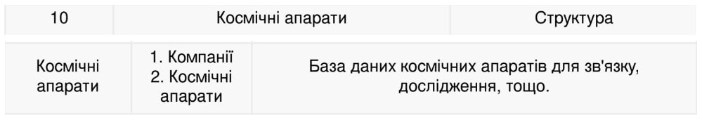

<p align="center"><b>МОНУ НТУУ КПІ ім. Ігоря Сікорського ФПМ СПіСКС</b></p>
<p align="center">
<b>Звіт з лабораторної роботи 5</b><br/>
"Робота з базою даних"<br/>
дисципліни "Вступ до функціонального програмування"
</p>
<p align="right"><b>Студентка</b>: Ус Вікторія Олександрівна, КВ-12</p>
<p align="right"><b>Рік</b>: 2024</p>

### Загальне завдання 
В роботі необхідно реалізувати утиліти для роботи з базою даних, заданою за варіантом. База даних складається з кількох таблиць. Таблиці представлені у вигляді CSV
файлів. При зчитуванні записів з таблиць, кожен запис має бути представлений певним
типом в залежності від варіанту: структурою, асоціативним списком або геш-таблицею.
1. Визначити структури або утиліти для створення записів з таблиць (в залежності від
типу записів, заданого варіантом).
2. Розробити утиліту(-и) для зчитування таблиць з файлів.
3. Розробити функцію select , яка отримує на вхід шлях до файлу з таблицею, а
також якийсь об'єкт, який дасть змогу зчитати записи конкретного типу або
структури. Це може бути ключ, список з якоюсь допоміжною інформацією, функція і
т. і. За потреби параметрів може бути кілька. select повертає лямбда-вираз,
який, в разі виклику, виконує "вибірку" записів з таблиці, шлях до якої було
передано у select . При цьому лямбда-вираз в якості ключових параметрів може
отримати на вхід значення полів записів таблиці, для того щоб обмежити вибірку
лише заданими значеннями (виконати фільтрування). Вибірка повертається у
вигляді списку записів.
4. Написати утиліту(-и) для запису вибірки (списку записів) у файл.

5. Написати функції для конвертування записів у інший тип (в залежності від
варіанту):
структури у геш-таблиці
геш-таблиці у асоціативні списки
асоціативні списки у геш-таблиці

6. Написати функцію(-ї) для "красивого" виводу записів таблиці.

### Варіант 10 (22)
<p align="center">
    
</p>

### Лістинг реалізації завдання
```lisp
(defstruct Company	;; Визначення структури Company
  company-id
  company-name
  location-country
  year-of-foundation
  founder
  description)

(defstruct Spacecraft	;; Визначення структури Spacecraft
  spacecraft-id
  spacecraft-name
  main-constructor
  max-speed-km-hour
  description)

(defun audytor (string)
  (string-trim '(#\Newline #\Return #\Space #\Tab) string))  ;; Очищаємо рядок від зайвих символів

(defun line-splitting (string)  ;; Функція для розділення рядка на частини за комами
  (let ((start 0)               ;; Початковий індекс для пошуку коми
        (result nil))           ;; Список для збереження частин рядка
    (loop                       ;; Цикл для пошуку коми і розділення рядка
     (let ((sep (position #\, string :start start))) ;; Шукаємо кому в рядку
       (if sep			;; Якщо знайшли роздільник кому
           (progn
             (push (audytor (subseq string start sep)) result)  ;; Додаємо частину рядка до результату
             (setf start (1+ sep)))  ;; Оновлюємо початкову позицію для пошуку наступної коми
           (return))))               ;; Завершаємо цикл, коли більше ком немає
    (push (audytor (subseq string start)) result)  ;; Додаємо останню частину рядка після останньої коми
    (nreverse result)))  	;; Робимо результат в зворотньому порядку і повертаємо

(defun get-structure-slots (struct-name)  ;; Функція для отримання імен слотів структури
  (mapcar #'sb-mop:slot-definition-name   ;; Отримуємо імена слотів структури
          (sb-mop:class-direct-slots (find-class struct-name))))  ;; Використовуємо MOP (Meta-Object Protocol) для знаходження слотів

(defun read-table-from-file (file-path structure-type)  ;; Функція для зчитування таблиці з файлу та створення структур
  (with-open-file (stream file-path)  	;; Відкриваємо файл для читання
    (let ((lines (loop for line = (read-line stream nil)  ;; Читаємо всі рядки з файлу
                       while line
                       collect line))
          (result nil))  			;; Ініціалізуємо змінну для зберігання структур порожнім списком
      (dolist (line lines result)  		;; Виконуємо для кожного рядка в файлі
        (let* ((parts (line-splitting line))  	;; Розділяємо рядок на частини
               (structure (funcall (intern (format nil "MAKE-~A" (string-upcase (symbol-name structure-type)))))))  ;; Створюємо структуру відповідного типу
          (let ((fields (get-structure-slots structure-type)))  	;; Отримуємо імена слотів структури
            (loop for field in fields  	;; Для кожного поля структури
                  for value in parts  	;; Для кожного значення з розділеного рядка
                  do (setf (slot-value structure field) value)))  ;; Записуємо значення в поле структури
          (if result  
              (nconc result (list structure))		;; Якщо результат вже містить елементи, додаємо нову структуру
              (setf result (list structure))))))))  	;; Якщо це перша структура, ініціалізуємо список

(defun select (file-path structure-type &rest filters)  ;; Функція для фільтрування рядків тяблиць
  (let* ((records (read-table-from-file file-path structure-type))  ;; Зчитуємо всі записи з файлу
         (filter-lambda  	;; Створюємо функцію для перевірки фільтрів
          (lambda (record)	;; Повертаємо анонімну функцію для виконання перевірки
            (every (lambda (filter)  		 ;; Для кожного фільтру перевіряємо чи відповідає запис
                     (let ((field (car filter))  ;; Отримуємо поле зі фільтру
                           (value (cdr filter))) ;; Отримуємо значення з фільтру
                       (equal (slot-value record field) value)))  ;; Перевіряємо чи значення поля відповідає фільтру
                   filters)))
         (filtered-records (remove-if-not filter-lambda records)))  ;; Фільтруємо записи
    filtered-records))  	;; Повертаємо відфільтровані записи

(defun write-structure-to-file (file-path records)  ;; Функція для запису структур у файл
  (with-open-file (stream file-path :direction :output :if-exists :overwrite :element-type 'character)  ;; Відкриваємо файл для запису
    (let* ((slots (get-structure-slots (type-of (first records)))))  ;; Отримуємо слоти з першої структури
      (dolist (record records)  	;; Для кожного запису
        (format stream "~{~a~^,~}~%"  	;; Форматуємо рядок для запису в CSV
                (mapcar (lambda (slot)  ;; Для кожного слоту
                          (let ((value (slot-value record slot)))  ;; Отримуємо значення для цього слоту
                            (cond
                              ((null value) "")  	;; Якщо значення nil, записуємо порожній рядок
                              ((stringp value) value)   ;; Якщо значення рядок, записуємо його
                              ((numberp value) (princ-to-string value)) ;; Якщо значення число, перетворюємо його на рядок
                              (t (princ-to-string value)))))  		;; Для інших типів значень перетворюємо на рядок
                        slots))))))

(defun convert-structures-to-hash-table (records)  ;; Функція для перетворення списку структур у хеш-таблицю
  (let ((hash-table (make-hash-table)))  ;; Створюємо порожню хеш-таблицю
    (dolist (record records)  		 ;; Проходимось по усіх записах
      (let ((key (gensym)))  		 ;; Створюємо унікальний ключ для кожного запису
        (setf (gethash key hash-table) record)))  ;; Додаємо запис у хеш-таблицю
    hash-table))  ;; Повертаємо хеш-таблицю

(defun print-structure-table (records)  	;; Функція для виведення таблиці структур на екран
  (when records  				;; Якщо список записів не порожній
    (let* ((slots (get-structure-slots (type-of (first records))))  ;; Отримуємо поля першої структури
           (headers (mapcar (lambda (slot) (string-upcase (symbol-name slot))) slots))  ;; Формуємо заголовки таблиці
           (rows (mapcar (lambda (record)  	   ;; Для кожного запису
                           (mapcar (lambda (slot)  ;; Для кожного слоту в записі
                                     (let ((value (slot-value record slot)))  	;; Отримуємо значення для цього слоту
                                       (if value value "")))  	;; Якщо значення є - конвертуємо його в рядок, якщо немає, вносимо порожній рядок
                                   slots))
                         records)))
      (format t "~{~a~^ | ~}~%" headers)
      (format t "~{~a~^~}~%" (make-list (length headers) :initial-element "----------------"))
      (dolist (row rows)
        (format t "~{~a~^ | ~}~%" row))
      (format t "~{~a~^~}~%" (make-list (length headers) :initial-element "----------------")))))
```

### Тестові набори та утиліти
```lisp
(defun auto-test ()	;; Функція для запуску тестування
  (format t "~%*Testing results LAB-5*~%")
  (format t "~%*Printing tables Companies and Spacecrafts*~%~%COMPANIES:~%")
  (let ((companies (read-table-from-file "D:/fp/lab5/Companies.csv" 'Company)))
    (print-structure-table companies))

  (format t "~%SPACECRAFTS:~%")
  (let ((spacecrafts (read-table-from-file "D:/fp/lab5/Spacecrafts.csv" 'Spacecraft)))
    (print-structure-table spacecrafts))

  (format t "~%*Print selected rows from table Spacecrafts where max-speed-km-hour = 10000*~%")
  (let ((spacecrafts (select "D:/fp/lab5/Spacecrafts.csv" 'Spacecraft
                            '(max-speed-km-hour . "10000"))))
    (print-structure-table spacecrafts))

  (format t "~%*Print selected rows from table Spacecrafts where max-speed-km-hour = 10000 and main-constructor Marie Adams*~%")
  (let ((spacecrafts (select "D:/fp/lab5/Spacecrafts.csv" 'Spacecraft
                            '(max-speed-km-hour . "10000")
                            '(main-constructor . "Marie Adams"))))
    (print-structure-table spacecrafts))

  (format t "~%*Write selected rows from table Spacecrafts where location-country = USA to file Selectfile.csv*~%")
  (let ((companies (select "D:/fp/lab5/Companies.csv" 'Company
                           '(location-country . "USA"))))
    (write-structure-to-file "D:/fp/lab5/Selectfile.csv" companies))

  (format t "~%*Printing results of converting structures into hash tables*~%~%")
  (let ((companies (read-table-from-file "D:/fp/lab5/Companies.csv" 'Company)))
    (let ((companies-hash (convert-structures-to-hash-table companies)))
      (format t "Hash-table: ~A~%" companies-hash))))

(auto-test)
```

### Тестування
```lisp
*Testing results LAB-5*

*Printing tables Companies and Spacecrafts*

COMPANIES:
COMPANY-ID | COMPANY-NAME | LOCATION-COUNTRY | YEAR-OF-FOUNDATION | FOUNDER | DESCRIPTION
------------------------------------------------------------------------------------------------
0 | SpaceX | USA | 2012 | Elon Musk | Most progressive space-learning company
1 | AstroFocus | Italy | 1998 | Gabriel Stetham | Star shipping leader
2 | Next Star | Singapore | 2004 | Chang Shi | Testing light-speed tecnologies
3 | Space Origin | USA | 2018 | Leonard West | Investments in the development of astrology
------------------------------------------------------------------------------------------------

SPACECRAFTS:
SPACECRAFT-ID | SPACECRAFT-NAME | MAIN-CONSTRUCTOR | MAX-SPEED-KM-HOUR | DESCRIPTION
--------------------------------------------------------------------------------
0 | Appolo | Jozeph Pilkingston | 5000 | Аor the exploration of Venus
1 | Cyclone 1 | Marie Adams | 10000 | Moon expedition rocket
2 | LoftShuttle | Steve Kinko | 10000 | Lux-class travelling ship
3 | Starship Beta | Chong Ki | 20000 | The fastest starship
--------------------------------------------------------------------------------

*Print selected rows from table Spacecrafts where max-speed-km-hour = 10000*
SPACECRAFT-ID | SPACECRAFT-NAME | MAIN-CONSTRUCTOR | MAX-SPEED-KM-HOUR | DESCRIPTION
--------------------------------------------------------------------------------
1 | Cyclone 1 | Marie Adams | 10000 | Moon expedition rocket
2 | LoftShuttle | Steve Kinko | 10000 | Lux-class travelling ship
--------------------------------------------------------------------------------

*Print selected rows from table Spacecrafts where max-speed-km-hour = 10000 and main-constructor Marie Adams*
SPACECRAFT-ID | SPACECRAFT-NAME | MAIN-CONSTRUCTOR | MAX-SPEED-KM-HOUR | DESCRIPTION
--------------------------------------------------------------------------------
1 | Cyclone 1 | Marie Adams | 10000 | Moon expedition rocket
--------------------------------------------------------------------------------

*Write selected rows from table Spacecrafts where location-country = USA to file Selectfile.csv*

*Printing results of converting structures into hash tables*

Hash-table: #<HASH-TABLE :TEST EQL :COUNT 4 {23D0C981}>
NIL
```
